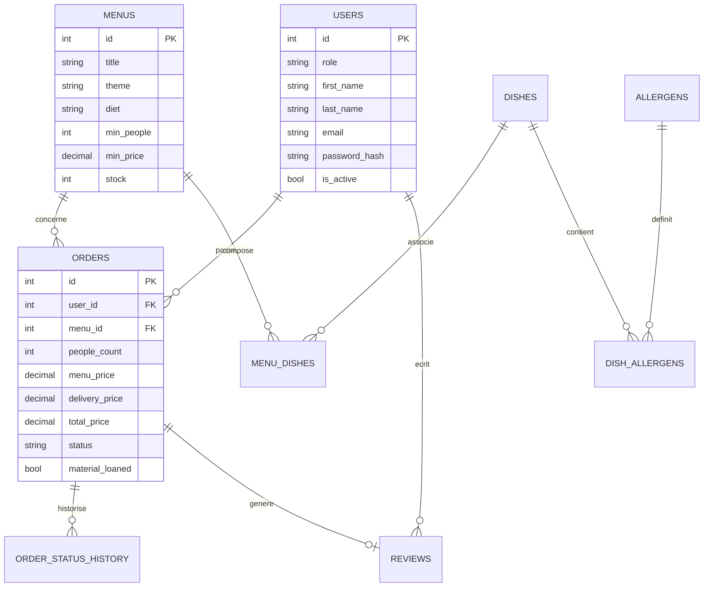
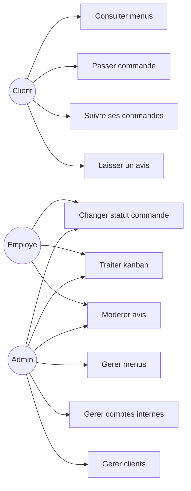
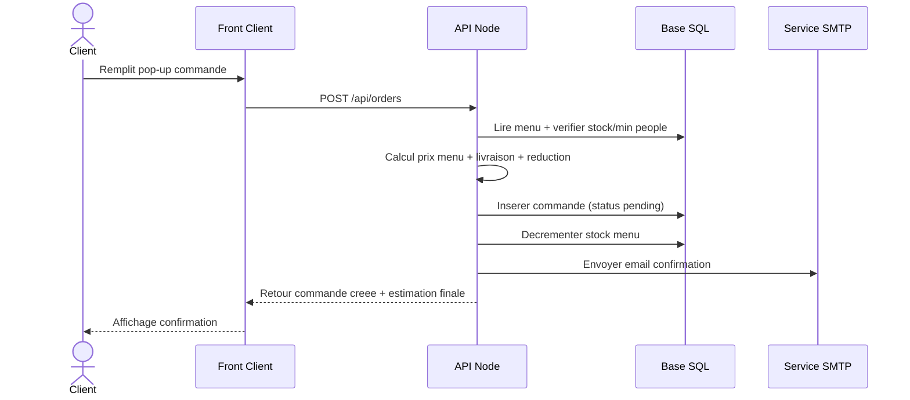

# Documentation Technique - Vite & Gourmand

## 1) Reflexion technologique initiale

Objectif: une application web complete, securisee, simple a deployer en local et presentable a l ECF.

Choix retenus:
- Front: HTML/CSS/JavaScript natif (maitrise directe, dependances limitees)
- Back: Node.js HTTP natif (API claire, controle fin)
- SQL: MySQL (production locale MAMP) + fallback SQLite
- NoSQL: MongoDB (stats/analytics)
- Mail: Nodemailer SMTP

Justification:
- Stack legere et pedagogique.
- Couvre SQL + NoSQL comme attendu.
- Permet de demonstrer architecture role-based (user/employee/admin).

## 2) Configuration environnement de travail

Prerequis:
- Node.js 20+
- npm
- MySQL (MAMP) ou SQLite fallback
- MongoDB local/Atlas (optionnel mais recommande)
- SMTP (Gmail + mot de passe application)

Installation:

```bash
npm install
cp .env.example .env
set -a
source .env
set +a
npm start
```

URL locale:
- `http://localhost:3000`

## 3) Architecture applicative

- `server.mjs`: routes API + serveur statique + logique metier
- `mailer.mjs`: envoi emails + templates
- `public/`: interfaces `index.html`, `client.html`, `staff.html` + JS/CSS
- `db/`: schemas SQL (SQLite + MySQL)
- `scripts/`: migration SQL et preparation du rendu

## 4) Modele conceptuel de donnees (MCD)



## 5) Diagramme d utilisation (cas d usage)



## 6) Diagramme de sequence (commande)



## 7) Dispositions securite

Mesures mises en place:
- Hash mot de passe serveur (`scrypt`) + comparaison securisee (`timingSafeEqual`)
- Regle mot de passe fort (min 10, maj/min/chiffre/special)
- Controle d acces par role sur chaque route sensible
- Verification `is_active` des comptes internes
- Requetes parametrees SQL (evite injections SQL)
- Limite taille payload JSON (anti abus basique)
- Secrets hors code source (`.env`, fichier exclu)
- `--exclude .env` dans la preparation du rendu

Points d attention:
- Sessions en memoire (suffisant pour prototype ECF)
- A renforcer en production: JWT signe, rate-limit, CSRF selon contexte

## 8) Documentation de deploiement

### Deploiement local

1. Installer prerequis
2. Configurer `.env`
3. Lancer `npm start`
4. Tester parcours client + staff

### Deploiement rendu propre

```bash
npm run prepare:rendu
```

Le script genere un dossier propre sans:
- `node_modules`
- `.env`
- base locale brute

### Deploiement cible (recommandation)

- Front + API sur un hebergeur Node
- Base MySQL managée
- MongoDB Atlas
- SMTP actif
- Variables d environnement configurees cote hebergeur
